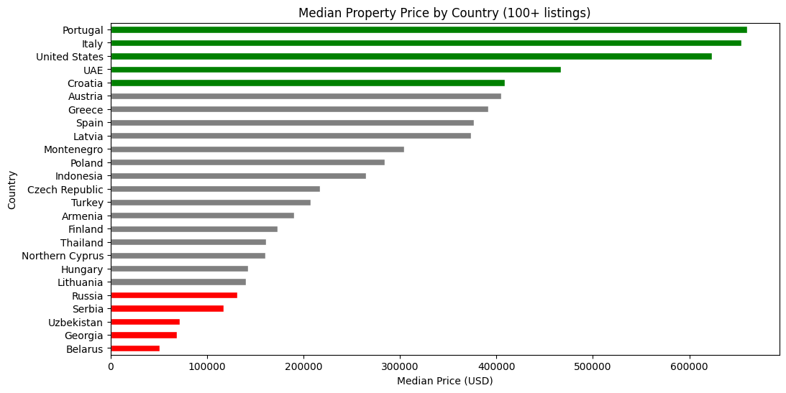
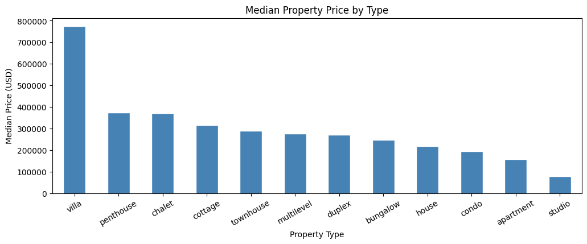
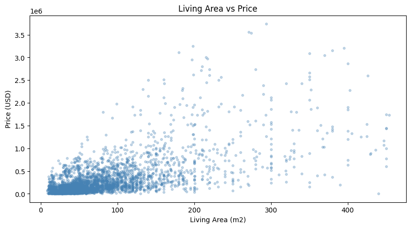
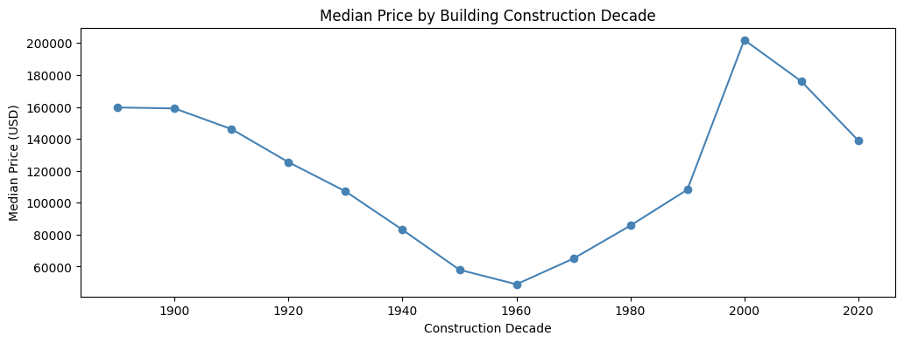

# 🏠 World Real Estate EDA

A full Exploratory Data Analysis (EDA) on a dataset of **147,000 global real estate listings**, performed using Python and Pandas as part of the Data Analytics Bootcamp at General Assembly.

---

## 📸 Analysis Preview

### Median Property Prices by Country



### Property Type Price Comparison



### Living Area vs Price Correlation



> Strong positive relationship identified between property size and listing price (Pearson correlation: 0.679).

### Building Age Analysis



---

## 📌 Project Overview

This project follows the complete data analytics workflow:

```text
Frame → Extract → Wrangle/Prepare → Analyze → Interpret → Communicate
```

The goal is to uncover key drivers of property prices worldwide through data cleaning, feature engineering, and targeted visualizations.

---

## 🧩 Problem Statement

A real estate investor approached our consulting firm seeking **data-driven guidance on global property markets**, with a focus on identifying trends and potential investment opportunities. Three core challenges were identified:

- **Investment Locations** — Determine the most lucrative global markets by analyzing regional trends and market dynamics
- **Property Type Value** — Identify high-value property types to strategically focus on high-return opportunities
- **Pricing Factors** — Investigate the various factors influencing price variations to support optimal investment decisions

---

## 📂 Dataset

- **Name:** World's Real Estate Data (147K listings)
- **Source:** [Kaggle – toriqulstu/worlds-real-estate-data147k](https://www.kaggle.com/datasets/toriqulstu/worlds-real-estate-data147k)
- **File:** `world_real_estate_data(147k).csv`

> ⚠️ To run this notebook, download the CSV from the Kaggle link above and place it in the same directory as the notebook.

---

## 📖 Data Dictionary

| Column | Type | Description |
|--------|------|-------------|
| `title` | str | Listing title |
| `country` | str | Country where the property is located |
| `location` | str | Full location string |
| `building_construction_year` | float | Year the building was constructed |
| `building_total_floors` | float | Total number of floors |
| `apartment_floor` | float | Floor level of the unit |
| `apartment_rooms` | float | Total number of rooms |
| `apartment_bedrooms` | float | Number of bedrooms |
| `apartment_bathrooms` | float | Number of bathrooms |
| `apartment_total_area` | str → float | Total property area in m² |
| `apartment_living_area` | str → float | Living area in m² |
| `price_in_USD` | float | Listing price in USD |
| `property_type` ⚙️ | str | Engineered property type |
| `price_per_sqm` ⚙️ | float | Engineered price per square meter |
| `building_age` ⚙️ | float | Engineered building age |

> ⚙️ = Feature engineered during analysis

---

## ❓ Business Questions

1. Which countries have the highest and lowest median property prices?
2. Which property types are the most expensive?
3. Is there a relationship between living area and price?
4. Do newer buildings cost more than older ones?

---

## 🛠️ Data Cleaning Steps

```text
✔ Checked for and removed duplicate rows
✔ Recovered missing country values from listing titles
✔ Engineered a new `property_type` column
✔ Converted area columns from strings to numeric
✔ Removed invalid/impossible values
✔ Dropped rows with missing price values
```

---

## ⚙️ Feature Engineering

Two additional analytical features were created:

- **`price_per_sqm`** — normalizes property prices by size for fair comparison
- **`building_age`** — calculated as `2026 − construction year`

These engineered fields improved cross-country comparison and age-based pricing analysis.

---

## 📊 Analysis Highlights

- Median property price by country
- Median property price by property type
- Property listing distribution analysis
- Living area vs price correlation analysis
- Building age trend analysis
- Country-level affordability comparison
- Price-per-square-meter analysis

---

## 🔍 Key Findings

| Question | Finding |
|----------|---------|
| **Country prices** | Portugal, Italy, and the US showed the highest median prices; Belarus and Georgia were the most affordable |
| **Property type** | Villas had the highest median prices at approximately $775K |
| **Area vs. price** | Strong positive correlation (r = 0.679) between size and property price |
| **Building age** | Heritage and modern buildings retained the highest market value |

---

## 🧰 Tech Stack

```python
Python
Pandas
Jupyter Notebook
Matplotlib
```

> Visualizations were created using pandas built-in plotting functionality with matplotlib as the backend.

---

## 📁 Project Structure

```bash
├── project.ipynb
├── world_real_estate_data(147k).csv
├── images/
│   ├── median-price-country.png
│   ├── property-type-prices.png
│   ├── area-vs-price.png
│   └── building-age-analysis.png
└── README.md
```

---

## 🚀 How to Run

```bash
# Clone repository
git clone https://github.com/your-username/your-repo-name.git

# Navigate into folder
cd your-repo-name

# Install dependencies
pip install pandas matplotlib jupyter

# Launch notebook
jupyter notebook project.ipynb
```

---

## 🎓 Course Info

**Program:** Data Analytics Bootcamp  
**Institution:** General Assembly  
**Project Type:** Python EDA Individual Project

---

## 👤 Author

**Ebrahim Alsawan**

- LinkedIn: linkedin.com/in/Ebrahim-Alsawan
